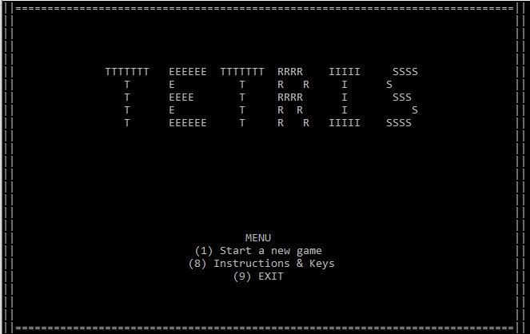

# 🎮 Tetris Console Game (C++)

A classic **two-player Tetris** game built in C++.
Developed entirely for the **Windows console**, using advanced C++ concepts such as object-oriented design, real-time input handling, and low-level screen manipulation.

---

## 🧠 Project Overview

This project recreates the Tetris experience using only **standard C++ libraries** and **Windows API functions** (`gotoxy`, `_kbhit`, `_getch`, `Sleep`, etc.).  
The game supports **two simultaneous human players**, each with their own board and controls, along with a **menu system**, **pause/resume**, and **instructions screen**.

---

## 🧩 Game Features

- Two-player gameplay on separate boards  
- Classic Tetris rules and all seven tetromino shapes  
- Rotations, drops, pausing, and win detection  
- Smooth Menu navigation (Start, Continue, Instructions, Exit)  
- Clear screen redraw and frame pacing using `Sleep()`  
- Modular design with reusable classes for shapes and boards  

---

## 📸 Screenshots

### 🏁 Main Menu

### 🧾 Instructions Screen

### 🎮 Gameplay

---

## ⚙️ How to Run

1. Open the `.sln` file in **Visual Studio 2019 or later**.  
2. Build and run the project (F5).  
3. Navigate the menu using number keys (1–9).  

---

## 🧱 Technical Concepts Demonstrated

- **Object-Oriented Programming (OOP):** Classes for Board, Shape, Game, and Player.  
- **Real-Time Input:** Using `_kbhit()` and `_getch()` for non-blocking control.  
- **Console Graphics:** Implementing movement and redraws using cursor positioning (`gotoxy`).  
- **Game Architecture:** Modular design separating logic, rendering, and input.  
- **Resource Management:** Clean handling of game state, memory, and screen updates.

---
Created by Amir Sofer
